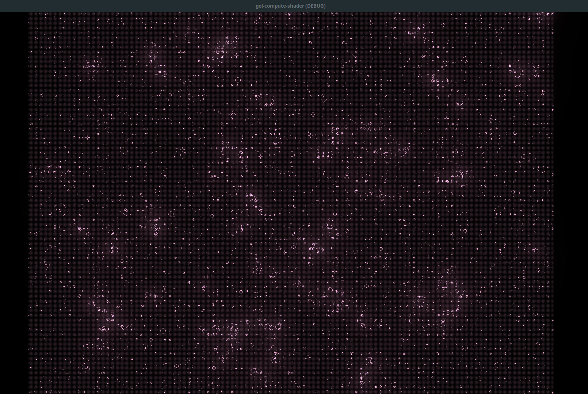

# gol-compute-shader

Godot Version 4.4.dev.custom_build [7f5c46929] ~= 4.3

## Controls

| Keybind | Action |
|---      |---     |
| Space | Toggle processing |
|R | Reset Scene|
|Mouse Scroll Up | Zoom Camera In|
|Mouse Scroll Down | Zoom Camera Out|
|W, A, S, D| Move camera, 8-dir WASD|

Configurations that may interest you will be found on the Dispatcher exports, such as the update frequency and auto-start for processing. Higher frequencies may yield a less-desirable result.

Glow effect can be edited on the WorldEnvironment Node.

## Known Issues
- Cells around the corners become invisible. I believe this is the texture data becoming distorted after a certain size due to precision errors, or an error in implementation that I cannot find.
  - Constraining the camera to be static and render at approximately `1.4` zoom (or higher) will hide the issue out of the viewport, though cells will still be active outside the camera viewport.

## Credits
- Special thanks to [hamsterbyte](https://www.youtube.com/@hamsterbyte) on YouTube for the dot matrix effect and [the walkthrough](https://www.youtube.com/watch?v=VQhi2w1E0iU&ab_channel=hamsterbyte) for setting up the compute shader.
  - Code found in this repo is highly based on the implementation in the video, but converted from C# and adapted to my personal preferences.

- All assets were made by myself using [LibreSprite](https://libresprite.github.io/#!/), designed to be similar to the originals.